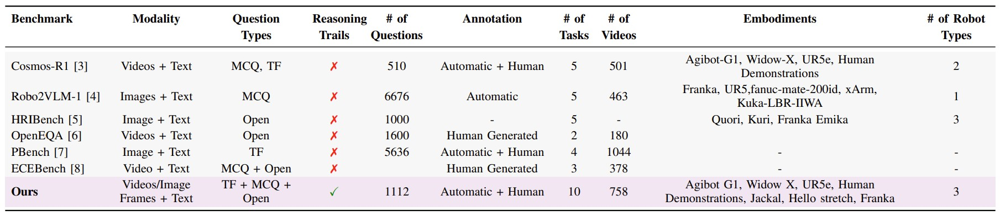

# How Good are Foundation Models in Step-by-Step Embodied Reasoning?


# Summary
<span style="display: block; word-wrap: break-word; white-space: normal;" align="justify">
Embodied agents operating in the physical world must make decisions that are not only effective but also safe, spatially coherent, and grounded in context. While recent advances in large multimodal models (LMMs) have shown promising capabilities in visual understanding and language generation, their ability to perform structured reasoning for real-world embodied tasks remains underexplored. In this work, we aim to understand how well foundation models can perform step-by-step reasoning in embodied environments. To this end, we propose the Foundation Model Embodied Reasoning (FoMER) benchmark, designed to evaluate the reasoning capabilities of LMMs in complex embodied decision-making scenarios. Our benchmark spans a diverse set of tasks that require agents to interpret multimodal observations, reason about physical constraints and safety, and generate valid next actions in natural language. We present (i) a large-scale, curated suite of embodied reasoning tasks, (ii) a novel evaluation framework that disentangles perceptual grounding from action reasoning, and (iii) empirical analysis of several leading LMMs under this setting. Our benchmark includes over 1.1k samples with detailed step-by-step reasoning across 10 tasks and 8 embodiments, covering three different robot types. Our results highlight both the potential and current limitations of LMMs in embodied reasoning, pointing towards key challenges and opportunities for future research in robot intelligence.
</span>


<!-- [Arxiv Link](),   [Project Page](https://mbzuai-oryx.github.io/FoMER-Bench/),   [GitHub Page](https://github.com/mbzuai-oryx/FoMER-Bench/) -->
[]()
[](https://mbzuai-oryx.github.io/FoMER-Bench/)

---
# Dataset Benchmark Comparison


<span style="display: block; word-wrap: break-word; white-space: normal;" align="justify">
  A comparison of various Embodied and Physical AI benchmarks. We summarize key features across benchmarks, including input modalities, question formats, presence of step-by-step reasoning trails, number of annotated questions, annotation methods, diversity of tasks and embodiments, and the types of robots involved. Our benchmark (last row) is distinguished by explicitly incorporating reasoning traces, supporting a variety of question types, and covering a broader set of tasks and robotic platforms compared to prior work.
</span>

---
# Experimental Results
<span style="display: block; word-wrap: break-word; white-space: normal;" align="justify">
Performance of different open source as well as closed source SoTA models, highlighting the reasoning accuracy as well as the final accuracy. Here, we evaluate the reasoning steps thoroughly using our proposed evaluation criteria.
</span>


---
# Citation
**BibTeX:**

```bibtex
@misc{
}
```
